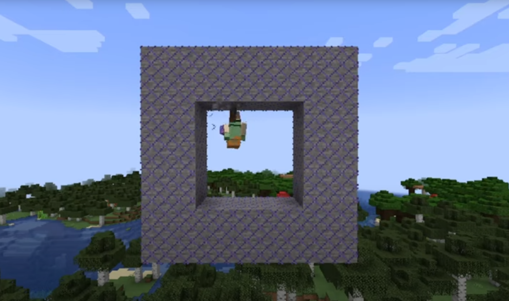
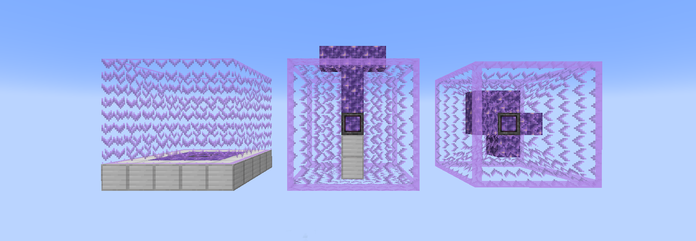

Introduces new blocks which allow you to control gravity with the hidden power of amethyst!

**This mod is a Fabric 1.20+ port of [Amethyst Gravity](https://modrinth.com/mod/amethyst-gravity)
by [CyborgCabbage](https://github.com/CyborgCabbage).**

### Gravity Plating

The most basic form of gravity control. There is also "Dense Gravity Plating", which has a taller area of effect, 
so that you can jump around and not fall off.

### Gravity Glasses

To see the generated gravity fields (as shown below), you need to put on a pair of gravity glasses.

### Gravity Generator

For larger areas of gravity control, you can use a gravity generator. There are three types available: 

*From left to right: Gravity Generator, Cylinder Gravity Generator, Planet Gravity Generator*

### Power

The larger you make the area of effect, the more amethyst blocks you need to place next to the generator to power it. 
Just hit "Apply Changes" in the generator's menu, and it will tell you how many blocks you need.

### Recipes

You can view all the recipes in the gallery.